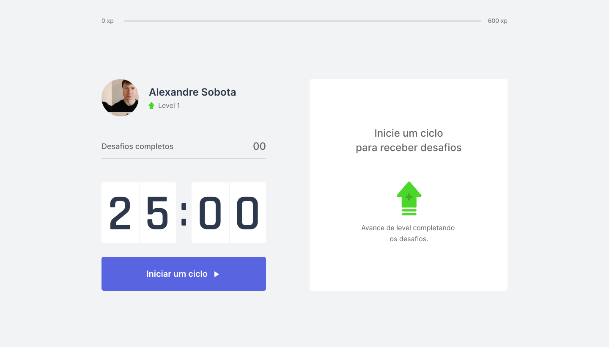

<h1 align="center">
    Project: MoveIt
    <h1 align="center">
    
    </h1>
    <h3 align="center">Application that marks the time of service, applying a rest break.</h3>
    <h3 align="center">Deployed <a href="https://moveit-xande098.vercel.app/">here</a>.</h3>
</h1>

<p align="center">
  <a href="#-technologies">Technologies</a>&nbsp;&nbsp;&nbsp;|&nbsp;&nbsp;&nbsp;
  <a href="#-project">Project</a>&nbsp;&nbsp;&nbsp;|&nbsp;&nbsp;&nbsp;
  <a href="#-layout">Layout</a>&nbsp;&nbsp;&nbsp;|&nbsp;&nbsp;&nbsp;
  <a href="#information_source-how-to-use">How to use</a>&nbsp;&nbsp;&nbsp;|&nbsp;&nbsp;&nbsp;
  <a href="#-how-to-contribute">How to contribute</a>&nbsp;&nbsp;&nbsp;|&nbsp;&nbsp;&nbsp;
  <a href="#memo-license">License</a>
</p>

<p align="center">
 

  
</p>

<br>

## 🚀 Technologies

This project was developed with the following technologies:

- [React](https://reactjs.org)
- [TypeScript](https://www.typescriptlang.org/)
- [Next](https://nextjs.org/)

## 💻 Project

MoveIt is a project that serves to measure the time worked by applying the Pomodoro method, which is a time management system that encourages people to focus intensely and integrally on just one task over exactly 25 minutes.

<div style="display: flex">
  <div align="center">
    <strong style="font-size: 18px">Web</strong>
    <h1 align="center" style="margin-right: 28px">
      
    </h1>
  </div>
</div>

## 🔖 Layout

You can view or layout the project in the format through [this link](https://www.figma.com/file/8Wliif8NNvyUZOqD8mrQgq/My-Move.it-1.0?node-id=160%3A2761). Remembering that you will need to have a [Figma](http://figma.com/) account.

## :information_source: How to use

To clone and run this application, you'll need [Git](https://git-scm.com) + [Yarn](https://classic.yarnpkg.com/en/docs/install/#windows-stable) installed on your computer.

From your command line:


## Getting Started

```bash
# Clone this repository
$ git clone 

# Go into the repository
$ cd nlw-04-moveit

# Install dependencies
$ yarn

# Run
$ yarn dev

# running on port 3000
```

Open [http://localhost:3000](http://localhost:3000) with your browser to see the result.


## Learn More

To learn more about Next.js, take a look at the following resources:

- [Next.js Documentation](https://nextjs.org/docs) - learn about Next.js features and API.
- [Learn Next.js](https://nextjs.org/learn) - an interactive Next.js tutorial.


## 🤔 How to contribute

-  Make a fork;
-  Create a branch with your feature: `git checkout -b my-feature`;
-  Commit changes: `git commit -m 'feat: My new feature'`;
-  Make a push to your branch: `git push origin my-feature`.

After merging your receipt request to done, you can delete a branch from yours.

## :memo: License

This project is under the MIT license. See the [LICENSE](LICENSE) for details.

---

Made with ♥ by Alexandre Sobota :wave: [Get in touch!](https://www.linkedin.com/in/alexandre-sobota)
